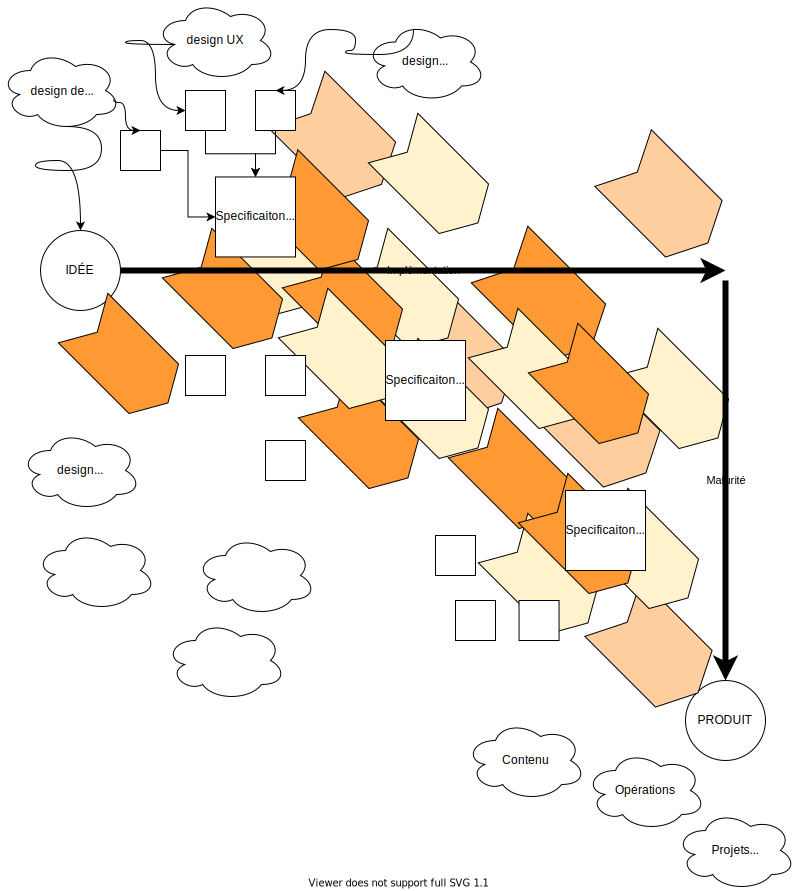

[fr](README.md) - [es](LÉEME_mx.md)

# Nous, un générateur statique multicontextuel


Ensemble de schémas et de générateurs statiques permettant de prototyper une application web.





## Générateur de mise en page 


```
nous -s data.yml > index.html
```	


# Nous, le design en tant qu'outil de conception raisonnée
 
  - L'activité de design, c'est-à-dire de réflexion est le coeur du développement numérique.
  - Le design est un point focal. Toutes les parties prenantes doivent être impliquées.
  - Le design est la seule activité qui demande une gouvernance et qui doit avoir des mécanismes de médiation.
  - Toutes autres activitées (implémentation, opération et utilisation) doit être autonome.
  - Le résultat du design est une spécification.
  - La spécificaiton est un document quelconque qui décrit une partie de la solution.

  - Le design  est décomposé en domaines qui sont, en théorie, autonomes.
 

*Exemple, la spécification d'une solution peut-être utilisée par plusiques spécificaitons applicatives. Même les sous-composants de bas niveau devraient pouvoir être réutilisés par d'autres projets.*

  - Le design prend du temps. Donc, les spécifications évoluent.
 
*La spécificaiton initiale doit être minimale. On ajoutera de la complexité lorsque la situation l'exigera, pas avant. (design paresseux)*

  - Chaque éléments de la spécification doit être formulé de manière ce que son implémentation soit vérifiable.
  - Plusieurs spécifications devraient cohabiter.
  - Les implémentations sont laissées à la discrétion des individus qui y travaillent.
  - Un travail qui ne brise rien et qui respecte les specificaitons devrait être accepté automatiquement.
  - Si quelqu'un n'est pas content, il peut soit proposer une amélioraiton à l'implémentation, soit une amélioration au design.


## Spécification de la solution


### Design de la solution

Répond aux questions sur le sens du projet.

  - Quel problème cherche-t-on à résoudre?
  - Que cherche-t-on à faire?
  - Pourquoi est-ce intéressant?
  - Quel est le besoin?
  - À qui cela va-t-il être utile?
  - Que va-t-on inclure ou exclure (portée)?
  - Quels seront les bénéfices?

### Design de l'expérience utilisateur

Répond aux questions concernant les utilisateurs.

  - Qui sont les personnes qui entrerons en contact avec ce produit?
  - Quels sont leurs cultures, leurs pratiques, leurs façons de faire?
  - Qu'est-ce qui les irrite, qui les freine, qui les bloque?
  - Qu'est-ce qui les motive, les stimule, les fait avancer? 

### Design de l'expertise

Réponds aux questions sur le domaine (métier) expert

  - Qu'a-t-ton besoin de connaitre concernant ce problème?

### Spécification applicative

Répond aux questions sur la manière dont sera réalisée la solution.


### Spécification de qualité

### Design de la performance


### Design de l'utilisabilité

### Design de la robustesse

### Design de la sécurité

